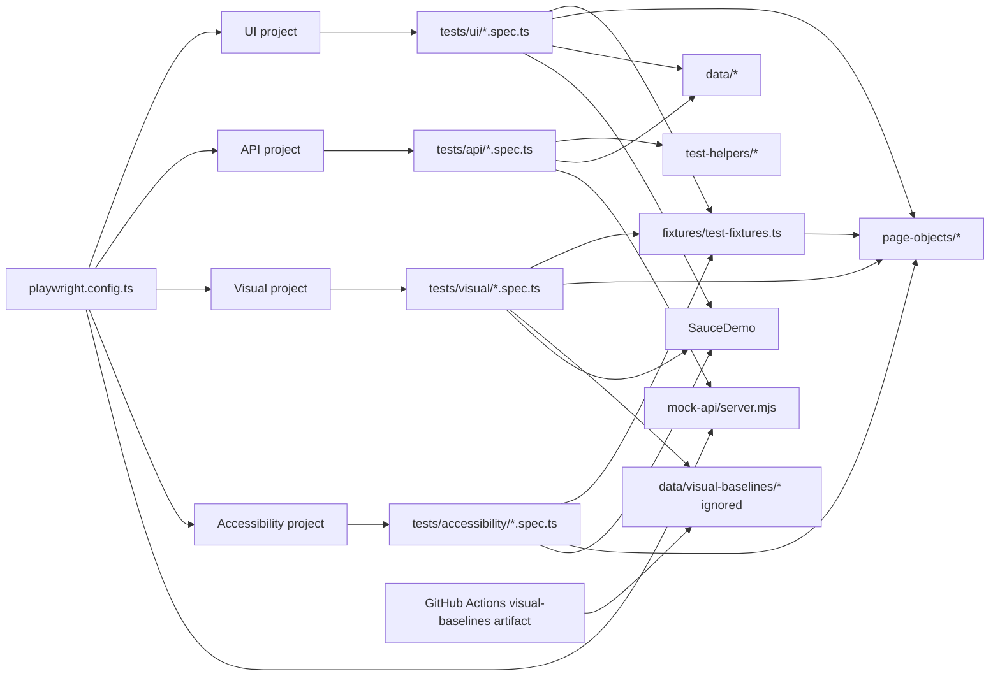

# System Architecture

## Overview

The project is a Playwright test framework with four execution paths: live UI tests against SauceDemo, visual regression tests against SauceDemo, accessibility checks against SauceDemo, and local API tests against an in-memory mock REST API.

## Architecture Diagram

## Playwright Configuration

`playwright.config.ts` is the central runtime contract:

- `testDir` is `./tests`.
- Tests run fully parallel.
- CI retries once; local retries are disabled.
- HTML report is generated without auto-open.
- GitHub reporter is used on CI.
- Traces are collected on first retry.
- Screenshots are collected only on failure.
- `data-test` is the configured test id attribute.
- `expect.toHaveScreenshot.pathTemplate` stores runtime visual baselines under ignored `data/visual-baselines/`, split by platform.

## CI Flow

`.github/workflows/tests.yml` runs the CI gate: install dependencies, install
Playwright browsers, run `npm run typecheck`, restore or generate visual
baselines, run `npm test`, run the visual project, and upload refreshed
baselines plus the Playwright report as artifacts.

## UI Test Flow

1. A UI spec imports either `@playwright/test` or `fixtures/test-fixtures.ts`.
2. Logged-in suites use `loggedInPage`.
3. Page objects expose locators and interactions.
4. Specs perform business assertions.
5. Browser traffic goes to `https://www.saucedemo.com`.

## API Test Flow

1. Playwright starts `mock-api/server.mjs`.
2. The `api` project uses `http://localhost:${MOCK_API_PORT}` as `baseURL`.
3. Specs call endpoints through Playwright `request`.
4. Assertions compare responses with constants from `data/api-test-data.ts`.
5. Contract specs validate mock API response shapes with JSON schemas.

## Visual Test Flow

1. The `visual` project runs `tests/visual/*.spec.ts` against SauceDemo.
2. Visual specs reuse fixtures and page object locators for setup and stable targets.
3. Assertions call `toHaveScreenshot` on pages or locators.
4. CI restores baselines from the latest successful `main` workflow artifact, or generates missing baselines when no artifact exists.
5. Playwright compares screenshots with baselines in ignored `data/visual-baselines/`.
6. Intentional CI visual changes are published through the manual `Playwright Tests` workflow with `visual_baseline_update` set to `changed` or `all`.

## Accessibility Test Flow

1. The `accessibility` project runs `tests/accessibility/*.spec.ts` against SauceDemo.
2. Accessibility specs reuse fixtures and page objects for setup.
3. Assertions use `@axe-core/playwright` with WCAG 2A and 2AA tags.
4. The inventory scan excludes only the known unlabeled SauceDemo sort select.

## Mock API

The mock API uses Node `http` only. It keeps products, categories, users, and posts in memory. It supports:

- `GET /health`
- `GET /products`
- `GET /products/categories`
- `POST /products`
- `GET /products/:id`
- `GET /users`
- `GET /users/:id`
- `POST /login`
- `GET /posts`
- `POST /posts`
- `GET|PUT|DELETE /posts/:id`

## Key Boundaries

- Page objects own UI locators, interactions, and readiness checks.
- Specs own scenario setup and business assertions.
- `test-helpers/` owns reusable Playwright-aware assertion and validation helpers.
- `data/` owns shared literals and expected values.
- `data/visual-baselines/` holds ignored runtime screenshot baselines.
- `mock-api/` owns deterministic API behavior.
- `playwright.config.ts` owns execution projects and server startup.
